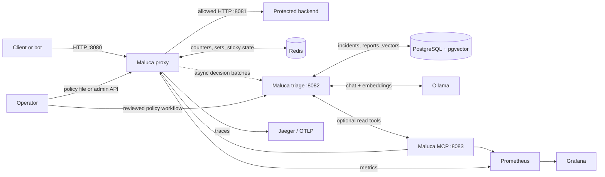
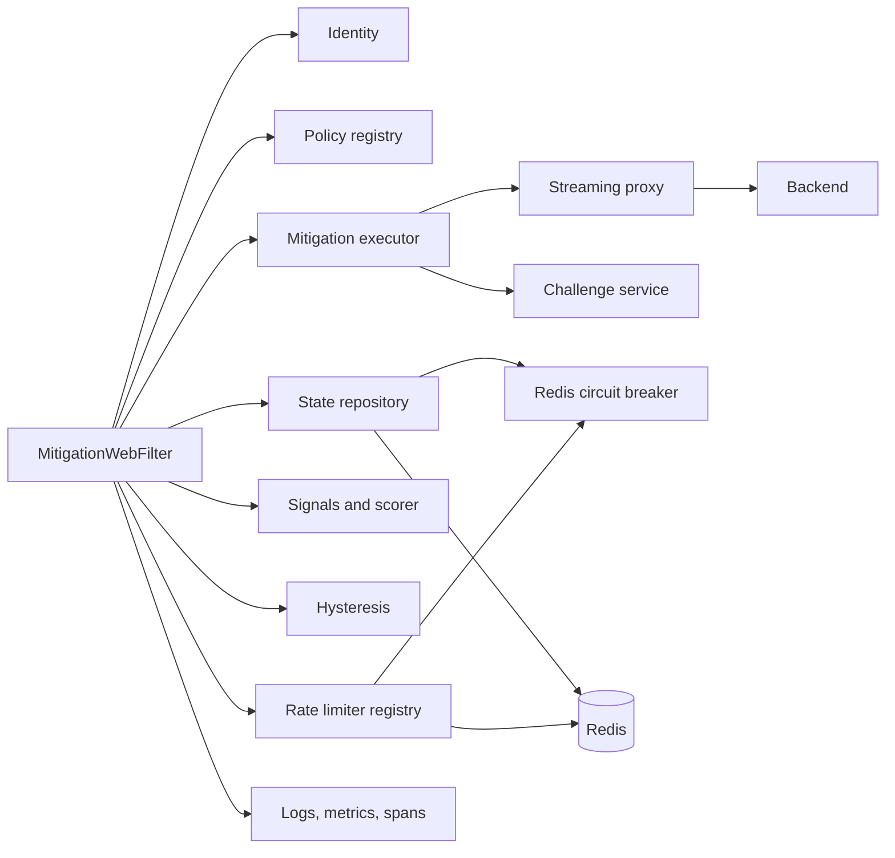
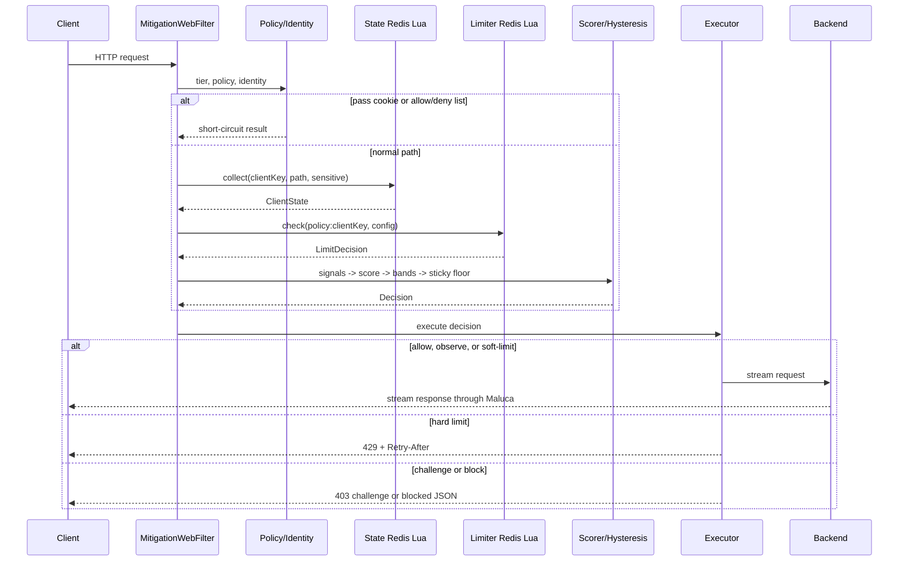
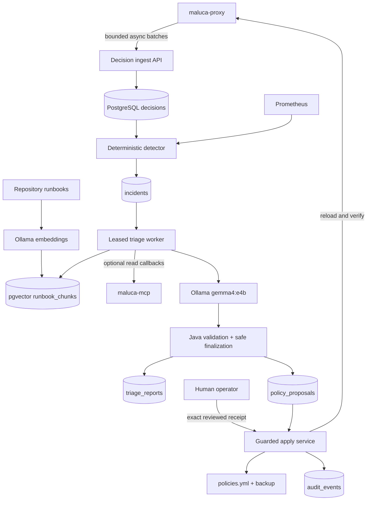

# Maluca: a beginner's guide from system design to code flow

This guide explains the entire repository for someone who is new to Java,
Spring, backend development, AI application design, and distributed systems.
It starts with the big picture, moves down to classes and methods, follows an
HTTP request through the proxy, and then follows the resulting operational
evidence through incident detection, pgvector retrieval, local Ollama
inference, validation, reporting, MCP tools, and human-approved remediation.

The guide describes the code that is in this repository now. Where a comment or
README describes an ideal behavior but the implementation has an important
edge case, the guide calls that out explicitly in [Current implementation
notes](#20-current-implementation-notes). That distinction is a valuable part
of learning how to read a real codebase.

## How to use this guide

For a first pass, read sections 2, 4, 5, 10, 19, 26, 28, 30, 35, 40, and 46.
That gives you the story without every implementation detail. If Java and
Spring syntax are new, read sections 6 and 7 before returning to the component
catalog. Sections 11-18 are the proxy's low-level design. Sections 29-39 are
the AI control plane's low-level design. Sections 40-44 are most useful when
you are ready to run, test, troubleshoot, review, or change the system.

Keep the repository open beside the guide. When a class is named, use your
editor's file search or "go to class" feature to open it. Do not try to memorize
everything: repeatedly connecting one class to its input, output, and caller is
the goal.

## 1. What you should understand by the end

After reading this guide, you should be able to explain:

- what problem Maluca solves and where it sits in a network;
- the difference between high-level design (HLD) and low-level design (LLD);
- why the repository has five Java modules and several optional services;
- how Spring Boot creates and connects the application's objects;
- what reactive programming means in this codebase;
- how Maluca identifies a client, chooses a policy, collects state, rate-limits,
  scores risk, applies hysteresis, and executes a mitigation;
- how an allowed request is streamed to the demo backend;
- how proof-of-work challenges and signed pass cookies work;
- how Redis Lua scripts make shared decisions atomic;
- why incident detection is deterministic even though report generation uses
  an LLM;
- how embeddings, pgvector, RAG, Ollama, structured output, grounding, and MCP
  fit together;
- why an invalid model patch is discarded without discarding an otherwise
  grounded diagnosis;
- how PostgreSQL leases, hashes, audit rows, and human approval prevent stale
  or autonomous policy application;
- how configuration, hot reload, metrics, traces, tests, Docker, and
  multi-instance deployment fit together; and
- where you would make a change for a new policy, signal, limiter, or action.

## 2. The one-paragraph mental model

Maluca has a **data plane** and an optional **control plane**. The data plane is
a security guard in front of another HTTP application: it identifies callers,
uses Redis-backed behavior and rate limits, computes a 0-100 risk score, and
either forwards or mitigates each request. The control plane stays off that
latency-sensitive path: it receives copied decisions asynchronously, detects
incidents with fixed Java rules, retrieves trusted runbooks from pgvector, asks
a local Ollama model for a structured cited report, and accepts only output that
passes Java safety checks. A model may propose a typed policy delta, but a
separate authenticated human workflow is required to approve and apply it.

The shortest useful flow is:

```text
client
  -> Maluca WebFilter
  -> identity + policy
  -> Redis behavior + Redis rate limit
  -> signals + score + action
  -> forward to backend OR delay/429/challenge/403
  -> metrics, trace, and decision log
```

The optional incident flow is:

```text
proxy decision
  -> bounded asynchronous export
  -> PostgreSQL decision history
  -> deterministic anomaly detector
  -> incident with frozen aggregate evidence
  -> focused pgvector runbook retrieval
  -> local Ollama structured JSON
  -> Java grounding/citation/policy validation
  -> persisted report and optional proposal
  -> separate human review and guarded application
```

## 3. Essential vocabulary

| Term | Beginner-friendly meaning | Maluca example |
|---|---|---|
| HTTP request | A client's message asking a server to do something | `GET /api/products?page=0` |
| HTTP response | The server's status, headers, and optional body | `200 OK` plus product JSON |
| Backend/upstream | The application that owns the real business endpoint | `demo-backend` on port 8081 |
| Reverse proxy | A public server that receives requests and forwards them to another server | Maluca on port 8080 |
| Bot/DDoS mitigation | Reducing abusive automated traffic before it harms the backend | delay, 429, challenge, or block |
| Rate limit | A rule restricting how frequently a key may act | 5 login attempts per 60 seconds |
| Client key | The string under which a caller's state is stored | IP, fingerprint, or a composite |
| Signal | One fact that may suggest risk | 40 requests in 10 seconds |
| Score | A combined numerical estimate of risk | 72 out of 100 |
| Policy | Route-specific instructions for limits, bands, and failure behavior | the `/login` policy |
| Hysteresis | Remembering a severe action briefly so it does not oscillate | remain rate-limited for 30 seconds |
| Fail open | Allow traffic when a dependency cannot make the safety decision | product page during a Redis outage |
| Fail closed | Reject traffic when a dependency cannot make the safety decision | login during a Redis outage |
| Atomic operation | An operation no other operation can observe halfway through | a Redis Lua check-and-increment |
| Stateless instance | An app process whose important shared state is elsewhere | a Maluca process; state is in Redis |
| Latency | Time added while processing a request | Maluca's pre-upstream milliseconds |
| Throughput | Number of requests handled per unit of time | requests per second |
| SLI/SLO | A measurement and its target | p99 added latency under 5 ms |
| Data plane | The path that handles real user traffic | proxy + Redis + backend |
| Control plane | Slower operational analysis and configuration work | triage + MCP + PostgreSQL + Ollama |
| Incident | A durable record that a fixed anomaly rule fired | mitigation spike for policy `api` |
| Runbook | Reviewed operational guidance for a known incident family | `burst-flood.md` |
| Embedding | A numeric vector representing text meaning | 768 numbers from `nomic-embed-text` |
| Vector search | Finding text whose embedding is close to a query embedding | pgvector cosine search |
| RAG | Retrieval-augmented generation: retrieve trusted context before prompting | runbook chunks supplied to Gemma |
| Ollama | A local server that runs downloaded chat/embedding models | `gemma4:e4b` on port 11434 |
| Grounding | Requiring an AI claim to match supplied evidence | exact `total_decisions=420` pair |
| Citation | A pointer to the exact retrieved source used by a report | `burst-flood.md#symptoms` |
| Structured output | Model output constrained to a known JSON shape | `TriageResult` |
| MCP | Model Context Protocol, a standard way to expose named tools | `get_incidents`, `search_runbooks` |
| Lease/fencing token | Temporary ownership that prevents a late worker overwriting newer work | incident `triage_lease_id` |
| Idempotency | Repeating the same delivery does not duplicate its effect | decision `event_id` primary key |
| CAS | Compare-and-swap: update only if the reviewed version still matches | policy SHA + incident version checks |
| Fail closed | Refuse unsafe progress when required proof is missing | reject an ungrounded model citation |

### HLD versus LLD

High-level design answers questions such as:

- Which deployable services exist?
- Which service talks to which other service?
- Where is state stored?
- How does the system scale or fail?
- What are the major security and performance trade-offs?

Low-level design answers questions such as:

- Which class owns a responsibility?
- Which method calls which method?
- What objects move between steps?
- What Redis keys and Lua arguments are used?
- What happens on each branch and exception?

In this repository, the Docker services and main request pipeline are HLD. The
`MitigationWebFilter.filter(...)` chain, records such as `RiskSignals`, and the
exact Lua return values are LLD.

## 4. Repository map

```text
maluca/
├── build.gradle                    shared Java/Spring dependency rules
├── settings.gradle                 declares all five Gradle modules
├── gradlew, gradle/                 pinned Gradle wrapper
├── docker-compose.yml              Redis + backend + proxy + optional observability
├── docker-compose.multi.yml        two proxies behind NGINX
├── docker-compose.triage.yml       PostgreSQL/pgvector + Ollama + triage + MCP
├── docker-compose.gpu.yml          optional NVIDIA Ollama acceleration
├── maluca-contracts/               shared immutable wire/data contracts
├── maluca-proxy/                   the real mitigation reverse proxy
│   ├── build.gradle
│   └── src/
│       ├── main/java/com/maluca/    production Java, grouped by responsibility
│       ├── main/resources/          config, policies, UA rules, Lua, logging
│       └── test/java/com/maluca/    unit, Redis, robustness, and integration tests
├── maluca-triage/                  incident detector, RAG, agent, reports, policy workflow
├── maluca-mcp/                     bounded Streamable-HTTP operational tools
├── demo-backend/                   small protected Spring WebFlux application
├── config/policies.yml             external policy example for hot reload
├── docs/runbooks/                  seven trusted incident-response sources
├── docs/triage/                    detailed AI architecture/security/data/evaluation docs
├── docs/                           design, algorithms, benchmarks, SLOs, this guide
├── infra/                          Prometheus, alerts, and NGINX configuration
├── ops/                            Grafana and proxy/triage operator runbooks
└── scripts/                        traffic generators, benchmarks, chaos, git hook
```

### Why there are five Java modules

`settings.gradle` includes five Gradle subprojects. Four produce executable
Spring Boot applications; the contracts module produces a shared library JAR.

- `maluca-proxy` is the latency-sensitive data plane. Clients call port 8080.
- `demo-backend` is a teaching/test target. Maluca forwards allowed calls to it
  on port 8081.
- `maluca-contracts` contains records and enums shared across process
  boundaries. It has no server and owns no database.
- `maluca-triage` is the incident control plane on port 8082. It owns the
  PostgreSQL schema and talks to pgvector and Ollama.
- `maluca-mcp` is the stateless operations-tool gateway on port 8083.

The root `build.gradle` supplies shared rules: Java 21, Maven Central, Spring
Boot dependency versions, UTF-8 compilation, and JUnit Platform. Each module's
own `build.gradle` adds the dependencies it needs.

### The most important proxy dependencies

| Dependency | Purpose |
|---|---|
| Spring Boot WebFlux | Reactive HTTP server, controllers, filter, and `WebClient` |
| Reactive Spring Data Redis | Non-blocking Redis access through Lettuce |
| Actuator + Micrometer Prometheus | Health and metrics endpoints |
| Micrometer tracing + OpenTelemetry | Trace/span creation and OTLP export |
| Resilience4j | Circuit breaker around decision-path Redis calls |
| Jackson YAML | Reads policy and user-agent YAML files |
| Logstash Logback encoder | Structured JSON logs in Docker |
| JUnit, Reactor Test, jqwik, Testcontainers | Test support |

The control plane additionally uses Spring MVC with virtual threads, Spring
JDBC, Flyway, PostgreSQL/pgvector, Spring AI's Ollama and vector-store support,
and Spring AI MCP client/server support. Section 29 explains why the proxy and
control plane intentionally use different runtime styles.

## 5. High-level design (HLD)

### 5.1 Problem and requirements

The protected backend should not have to implement bot defense itself. Maluca
therefore needs to:

1. inspect every public request before the backend sees it;
2. distinguish callers well enough to aggregate suspicious behavior;
3. keep recent behavior consistent across proxy instances;
4. support different traffic rules for login, checkout, APIs, and health;
5. use progressive responses instead of treating every suspicion as a block;
6. keep request bodies streaming instead of loading large bodies into memory;
7. explain why it made each decision;
8. remain available when Redis or the backend misbehaves; and
9. be observable and operable in production.

### 5.2 System context



The critical boundary is that clients cannot call the backend directly in the
Docker topology: the backend port is exposed only inside the Docker network.
The proxy is the public enforcement point. Dashed decision export is optional
and asynchronous: PostgreSQL, Ollama, or MCP failure must not make a customer
request wait.

### 5.3 Major components



`MitigationWebFilter` is the orchestrator. Most other classes do one focused
job and are injected into it. This is composition: complex behavior is built by
connecting smaller objects rather than putting every detail in one giant class.

### 5.4 Data ownership

| Data | Owner/location | Scope and lifetime |
|---|---|---|
| Infrastructure configuration | `application.yml` + environment | Loaded when an instance starts |
| Behavioral policies | classpath or external `policies.yml` | Immutable snapshot, atomically hot-swapped |
| UA classification rules | `ua-classes.yml` | Loaded once into each instance |
| Behavior counters | Redis keys under `maluca:` | Per client key, seconds to one hour |
| Rate-limit state | Redis keys under `maluca:rl:` | Per policy + client key |
| Sticky action | Redis `maluca:sticky:<clientKey>` | Per client, TTL based on severity |
| Challenge replay marker | Redis `maluca:chal:used:<id>` | Short-lived, one-time-use protection |
| Verified-bot DNS cache | Redis `maluca:fcrdns:<ip>` | 24 hours |
| Challenge/pass contents | HMAC-signed client token/cookie | Stateless except replay marker |
| Metrics | In-process Micrometer registry, scraped by Prometheus | Aggregated time series |
| Exported decisions | PostgreSQL `decisions` | Seven days by default; duplicate UUIDs ignored |
| Incidents and frozen stats | PostgreSQL `incidents` | Durable lifecycle and optimistic version |
| Trusted runbook vectors | PostgreSQL `runbook_chunks` with pgvector | 35 current H2 chunks |
| Generated reports | PostgreSQL `triage_reports` | One replaceable projection per incident |
| Policy proposals | PostgreSQL `policy_proposals` | Typed delta plus report and policy hashes |
| Apply audit | PostgreSQL `audit_events` | Durable review/application history |

The Java processes are horizontally replaceable because shared security state
lives in Redis. A process restart loses in-memory connection pools and metric
counters, but it does not reset fleet-wide rate limits or sticky actions.

### 5.5 Single-instance deployment

`docker-compose.yml` creates one network and normally starts:

- Redis 7.2 on internal port 6379;
- the demo backend on internal port 8081;
- Maluca on public port 8080; and
- optionally Prometheus, Grafana, and Jaeger under the `observability` profile.

The proxy waits for healthy Redis and backend containers before it starts. The
development Redis explicitly disables persistence, so restarting that container
resets security state. That is suitable for a demo, not automatically a
production Redis design.

Adding `docker-compose.triage.yml` under the `triage` profile starts the
optional control plane: pgvector PostgreSQL, Ollama, a one-shot model-pull
container, triage, MCP, and Prometheus. PostgreSQL and Ollama model files use
named volumes. The host Ollama model store and the Compose Ollama volume are
separate; seeing a model in host `ollama list` does not mean the container
already has it. Section 40 shows both host-model and Compose workflows.

### 5.6 Multi-instance deployment

`docker-compose.multi.yml` puts two Maluca processes behind NGINX. NGINX chooses
an instance round-robin, but both use the same Redis. This demonstrates an
important distributed-systems rule: local Java fields cannot enforce a global
limit, while one atomic shared Redis operation can.

```text
client -> NGINX -> proxy 1 --+
              \-> proxy 2 --+--> shared Redis
                    |
                    +----------> backend
```

The proxies do not need sticky load-balancer sessions because the state is not
stored only in either proxy.

### 5.7 Main design decisions and trade-offs

| Decision | Benefit | Cost/trade-off |
|---|---|---|
| Reactive WebFlux | High concurrency without one waiting thread per request | Reactive chains take practice to read and blocking work must be isolated |
| Redis shared state | Fleet-wide consistent counters | Network hop, shared dependency, throughput ceiling |
| Lua in Redis | Atomic read/modify/write with one script execution | Business logic spans Java and Lua |
| Weighted linear score | Fast and explainable | Simpler than adaptive/ML detection and easier to evade |
| Progressive actions | Better user experience than immediate blocking | More states and thresholds to tune |
| HMAC stateless tokens | Cheap verification without a token database | Secret rotation invalidates tokens; replay still needs Redis |
| Hot-swapped immutable policies | No partial reload state and no restart | File watcher behavior depends on filesystem/container mounts |
| Per-route fail mode | Availability/safety trade-off can match endpoint value | Correct failure handling must cover every Redis-dependent path |
| Async control-plane export | AI/database latency never joins the request path | Evidence can be dropped during a prolonged outage and is metered |
| Deterministic detection before AI | Incident creation is repeatable and testable | Fixed thresholds need deliberate tuning |
| Local Ollama inference | Evidence can remain on the operator's machine/network | Model speed and quality depend on local hardware and weights |
| RAG from reviewed runbooks | Guidance is source-cited and repository-controlled | Retrieval can miss the best chunk and must be evaluated separately |
| Strict Java output gate | Hallucinated evidence/citations/patches fail safely | A useful diagnosis can be downgraded when output formatting is poor |
| Separate human apply path | The model cannot autonomously change enforcement | Remediation requires more operational steps and credentials |

## 6. Java concepts used in this project

You do not need to master all of Java before reading the code. Recognize these
shapes first.

### 6.1 Packages and imports

The first line, such as `package com.maluca.scoring;`, gives a class a namespace.
The directory mirrors it: `com/maluca/scoring/WeightedLinearScorer.java`.
`import` lets a file use a class by its short name.

Packages here are organized by responsibility, not by technical file type:
`identity`, `policy`, `state`, `ratelimit`, `scoring`, and so on.

### 6.2 Classes, interfaces, records, and enums

- A **class** combines data and behavior. `ProxyService` holds collaborators and
  has methods that forward traffic.
- An **interface** defines a contract without choosing the implementation.
  `RateLimiter` says every limiter exposes `algorithm()` and `check(...)`.
- A **record** is a compact immutable data carrier. Java generates its
  constructor and accessors. `decision.score()` is the accessor for the `score`
  component of `Decision`.
- An **enum** is a fixed set of named values. `MitigationAction` is ordered from
  `ALLOW` to `BLOCK`.
- A **sealed interface** restricts its permitted result shapes. Challenge
  verification returns either `VerifyResult.Success` or `VerifyResult.Failure`.

Records are used heavily because requests move through explicit, immutable
snapshots: `RequestMeta` -> `RiskSignals` -> `ScoreResult` -> `Decision`.

### 6.3 Fields, constructors, `final`, and dependency injection

This pattern appears everywhere:

```java
private final Scorer scorer;

public MitigationWebFilter(Scorer scorer, /* ... */) {
    this.scorer = scorer;
}
```

The field remembers the collaborator. `final` means the reference cannot be
reassigned after construction. Spring sees the constructor, finds a bean that
implements `Scorer` (`WeightedLinearScorer`), and supplies it. This is
**constructor dependency injection**.

It improves testability: a test can construct a class with a controlled fake or
real dependency without relying on global variables.

### 6.4 Annotations

Annotations are metadata beginning with `@`. Spring reads them at startup.

| Annotation | Meaning here |
|---|---|
| `@SpringBootApplication` | Main app, auto-configuration, and component scan |
| `@Component` | General Spring-managed object |
| `@Service` | Component that expresses business/service logic |
| `@Repository` | Component responsible for persistence/state access |
| `@RestController` | Methods handle HTTP routes and return response bodies |
| `@Configuration` / `@Bean` | Code that constructs a configured object |
| `@ConfigurationProperties` | Binds YAML/environment values into a record |
| `@Primary` | Preferred implementation when several match an interface |
| `@GetMapping` / `@PostMapping` | Route a particular HTTP method and path |
| `@PreDestroy` | Run cleanup while Spring shuts down |

`@Service`, `@Repository`, and `@Component` all create beans; the different
names communicate intent to humans and tooling.

### 6.5 Generics and collections

`List<String>` means a list whose elements are strings. `Map<String, Double>`
means string keys and decimal-number values. Generics catch type mistakes at
compile time.

Common collection choices here are:

- `List` for ordered policies and Redis keys;
- `Set` for unique tier names and hop-by-hop header names;
- `Map` for score contributions and tier lookup; and
- `EnumMap` when enum values are the keys.

`List.copyOf`, `Set.copyOf`, `Map.of`, and record fields support immutability.

### 6.6 Lambdas, streams, and method references

Code such as:

```java
properties.sensitivePaths().stream().anyMatch(path::startsWith)
```

means: iterate the configured sensitive prefixes and return true if `path`
starts with any one of them. `path::startsWith` is a method reference. It is a
short form of `prefix -> path.startsWith(prefix)`.

### 6.7 Modern Java 21 features

The code uses switch expressions that return values, pattern matching such as
`value instanceof Number n`, text blocks (`"""..."""`), records, sealed types,
and `Math.clamp`. That is why the build specifies a Java 21 toolchain.

## 7. Spring Boot and WebFlux concepts

### 7.1 What Spring Boot does

Without Spring, application code would have to create every object in the right
order, configure the HTTP server, decode requests, connect Redis, and manage
shutdown. Spring Boot does the framework plumbing and creates an application
context: a registry of constructed objects called **beans**.

Spring scans downward from `com.maluca`, so all annotated classes under that
package are found. Auto-configuration also provides objects from dependencies,
including the reactive Redis template, Netty HTTP server, metric registry, and
observation registry.

### 7.2 Reactive types: `Mono` and `Flux`

- `Mono<T>` is a recipe for asynchronously producing zero or one `T`.
- `Flux<T>` is a recipe for asynchronously producing zero to many `T` values.
- `Mono<Void>` represents asynchronous completion with no useful result value.

Returning a `Mono` does not mean the result has already happened. Spring
subscribes to the returned publisher when it handles the request. Data and
completion signals then travel through the declared operators.

The most common operators in Maluca are:

| Operator | Meaning |
|---|---|
| `map` | Synchronously transform a value |
| `flatMap` | Start another asynchronous operation using a value |
| `then` | Ignore the previous value and continue after it completes |
| `thenReturn` | Wait for completion, then emit a fixed value |
| `switchIfEmpty` | Use another publisher if no value arrived |
| `onErrorResume` | Convert an error into a fallback publisher |
| `onErrorReturn` | Convert an error into one fallback value |
| `timeout` | Fail if completion takes too long |
| `Mono.defer` | Create the operation at subscription time |
| `doFinally` | Run cleanup for success, error, or cancellation |

`flatMap` is needed for Redis, DNS, rate limiting, and proxy I/O because those
operations finish later. A normal `map` is enough for pure scoring.

### 7.3 Why non-blocking matters

WebFlux normally runs request work on a small number of event-loop threads. If
code blocks one of those threads waiting for slow disk, DNS, or a network call,
many requests can stall. Redis and `WebClient` expose reactive APIs. The JDK DNS
resolver is blocking, so `VerifiedBotService` explicitly moves it to Reactor's
bounded-elastic scheduler with `subscribeOn(Schedulers.boundedElastic())`.

The code generally avoids calling `.block()`. The notable `.subscribe()` in
`ProxyService` intentionally records a backend 4xx count in the background; it
is a fire-and-forget side effect rather than part of the client response chain.

### 7.4 `ServerWebExchange`, filters, and controllers

`ServerWebExchange` contains both the incoming `ServerHttpRequest` and the
outgoing `ServerHttpResponse`.

`MitigationWebFilter` runs before normal controller routing. For `/actuator`
and `/_maluca` paths it calls `chain.filter(exchange)`, allowing Actuator or a
Maluca controller to handle the request. For public paths it never calls the
chain; it either writes a synthetic response or calls `ProxyService`.

That detail explains why Maluca does not need a catch-all proxy controller.

## 8. Application startup: exact conceptual flow

There are two independent startup paths.

### 8.1 Starting the proxy

Docker eventually executes `java $JAVA_OPTS -jar app.jar`. A local Gradle run
executes the same application through `:maluca-proxy:bootRun`.

1. The JVM loads `MalucaProxyApplication` and calls `main(String[] args)`.
2. `Hooks.enableAutomaticContextPropagation()` tells Reactor to preserve trace
   and logging context across asynchronous operator/thread boundaries.
3. `SpringApplication.run(...)` builds the Spring application context.
4. `@SpringBootApplication` enables auto-configuration and scans `com.maluca`.
5. `@ConfigurationPropertiesScan` finds `MalucaProperties` and binds values
   below the `maluca` YAML prefix. Environment placeholders such as
   `${REDIS_HOST:localhost}` use the environment value or the stated default.
6. Auto-configuration creates the Netty server, reactive Redis connection
   factory/template, Actuator endpoints, metrics, tracing, and logging support.
7. Spring constructs annotated application beans and injects constructor
   dependencies. Construction order is dependency-driven, not source-file
   order.
8. `WebClientConfig.upstreamWebClient(...)` creates the pooled Netty client used
   for backend calls, with configured connection and response timeouts.
9. `UaClassifier` reads `ua-classes.yml` into an ordered in-memory rule map.
10. `PolicyRegistry` reads the external policy file if it exists; otherwise it
    reads classpath `policies.yml`. It compiles patterns/CIDRs and publishes one
    immutable policy list. If an external file existed at startup, it also
    starts a daemon file-watcher thread.
11. `ClientStateRepository` and each concrete limiter create Redis script
    descriptors for Lua resources. Redis loads/caches scripts through Spring
    when they are executed.
12. `RateLimiterRegistry` receives all concrete `RateLimiter` beans and indexes
    them by `RateLimitAlgorithm`. Its `@Primary` annotation makes this dispatcher
    the `RateLimiter` injected into `MitigationWebFilter`.
13. `RedisCircuitBreaker` creates the in-process Resilience4j state machine and
    subscribes to transition events for logging.
14. Netty binds the configured port, normally 8080. The application is ready.

On shutdown, Spring uses graceful server shutdown and allows in-flight requests
up to the configured phase timeout. `PolicyRegistry.shutdown()` closes its watch
service and interrupts the watcher thread.

### 8.2 Starting the demo backend

`DemoBackendApplication.main(...)` calls `SpringApplication.run(...)`. Spring
finds `DemoController`, configures WebFlux/Netty, and binds port 8081. There is no
Redis or mitigation pipeline in this module.

## 9. Complete component catalog

This section gives every production Java component a place in the mental model.

### 9.1 Root and configuration

| Class | Responsibility |
|---|---|
| `MalucaProxyApplication` | Proxy JVM entry point and Reactor context propagation |
| `MalucaProperties` | Immutable typed view of `maluca.*` configuration |
| `WebClientConfig` | Creates the pooled, timeout-configured upstream `WebClient` bean |

`MalucaProperties` contains nested records for upstream, identity, limits,
scoring, bands, hysteresis, mitigation, resilience, and challenge settings. Its
`Limits.toConfig()` bridges global YAML settings to the algorithm-neutral
`RateLimitConfig` model.

### 9.2 Model: the vocabulary passed between layers

| Type | Meaning |
|---|---|
| `RequestMeta` | Method, path, selected headers, header order, optional JA3 value |
| `ClientIdentity` | IP plus network, session, fingerprint, and chosen composite keys |
| `ClientState` | Redis snapshot of recent counts and sticky action |
| `RiskSignals` | Flat set of behavioral/request facts given to the scorer |
| `ScoreResult` | Score plus named contribution map |
| `Decision` | Effective action, score, reason, contributions, retry time, dry-run flag |
| `LimitDecision` | Whether the rate limiter allowed, current value, limit, retry time |
| `RateLimitConfig` | Settings understood by all limiter algorithms |
| `RateLimitAlgorithm` | The five supported limiter names |
| `MitigationAction` | Ordered actions from `ALLOW` through `BLOCK` |
| `UaClass` | Browser/mobile/verified bot/bad bot/script/unknown classification |

These types prevent a `Map<String, Object>` from being passed everywhere. Each
stage gets a named, compiler-checked input.

### 9.3 Identity

| Class | Responsibility |
|---|---|
| `ClientIdentityExtractor` | Resolves peer/trusted-XFF IP and builds all identity layers |
| `FingerprintService` | SHA-256 hash of stable request-shape material |
| `UaClassifier` | First-match UA substring rules plus browser fallback heuristic |
| `VerifiedBotService` | Forward-confirmed reverse DNS and 24-hour result cache |
| `DatacenterDetector` | Checks the client IP against configured cloud CIDRs |
| `CidrSet` | Parses and matches IPv4/IPv6 addresses and prefixes |

Identity strategy changes only the key used for state:

```text
NETWORK     -> networkKey (normally the IP)
FINGERPRINT -> fingerprintKey, with network fallback
COMPOSITE   -> network|session-or--|fingerprint-or--
```

The session value itself is not stored; only the first 16 hex characters of its
SHA-256 hash are used. The fingerprint is similarly truncated to 16 hex
characters. These are correlation identifiers, not encryption.

For trusted proxy handling, both conditions must be true: XFF trust must be
enabled and the direct peer IP must appear in `trusted-proxies`. The extractor
then walks XFF right-to-left and selects the first untrusted hop. This avoids
believing client-prepended fake hops.

### 9.4 Policy

| Class | Responsibility |
|---|---|
| `PolicyDefinition` | Jackson/YAML input shape and policy enums |
| `CompiledPolicy` | Immutable hot-path form with parsed pattern and CIDR sets |
| `PolicyRegistry` | Load, compile, resolve, atomically reload, and watch policies |
| `ClientTierService` | Maps `X-Api-Key` to a configured tier or `anonymous` |
| `PolicyAdminController` | Token-guarded list/reload endpoints |

Resolution evaluates every active policy matching both path and optional tier,
then uses Spring's path-pattern specificity comparator. `/login` wins over
`/**`; `/api/checkout` wins over `/api/**`.

The registry builds a complete new list and only then calls
`active.set(newList)`. Because `AtomicReference` swaps the list as one reference,
a request sees either the old complete list or the new complete list, never half
of each. Invalid reloads leave the last good list active.

### 9.5 State and resilience

| Class | Responsibility |
|---|---|
| `ClientStateRepository` | Builds Redis keys, executes state Lua, pins actions, records 4xx |
| `LuaScripts` | Locates a classpath Lua resource and declares its list result |
| `RedisCircuitBreaker` | Timeout, circuit state, fallback, and Redis error metric |
| `RedisHealthIndicator` | Adds breaker/degradation detail to Actuator health |
| `DegradationState` | Names `FULL`, `RATE_LIMIT_ONLY`, and `PASSTHROUGH` tiers |

The behavior keys omit the policy name, so behavior is aggregated across routes
for the selected client key. The rate-limit keys include the policy name, so a
login budget does not consume an API budget. Sticky action is also client-wide,
not route-specific.

### 9.6 Rate limiting

| Class | Responsibility |
|---|---|
| `RateLimiter` | Common algorithm contract |
| `RateLimiterRegistry` | `@Primary` dispatcher selected by config enum |
| `RateLimiterSupport` | Decodes Lua's `{allowed,current,retry}` list |
| `FixedWindowRateLimiter` | Executes `fixed_window.lua` |
| `SlidingWindowCounterRateLimiter` | Executes `sliding_window_counter.lua` |
| `SlidingWindowLogRateLimiter` | Executes `sliding_window_log.lua` |
| `TokenBucketRateLimiter` | Executes `token_bucket.lua` |
| `LeakyBucketRateLimiter` | Executes `leaky_bucket.lua` |

The Java limiter classes are deliberately thin adapters. They choose a namespaced
key, turn configuration into string arguments, execute a Lua script, and decode
the response. The algorithm itself lives in Lua because it must execute
atomically next to the Redis data.

### 9.7 Scoring

| Class | Responsibility |
|---|---|
| `SignalsCollector` | Pure mapping from request/state/resolved facts to `RiskSignals` |
| `Scorer` | Contract for score implementations |
| `WeightedLinearScorer` | Current explainable 0-100 weighted implementation |

These are pure CPU code: no Redis, DNS, HTTP, or clock. That makes them fast and
easy to unit test.

### 9.8 Mitigation

| Class | Responsibility |
|---|---|
| `PolicyResolver` | Maps score bands to an ordered action |
| `HysteresisService` | Applies an old sticky floor and pins new severe actions |
| `MitigationExecutor` | Turns a `Decision` into forwarding, delay, or a response |

The score-to-action mapping checks most severe first:

```text
score >= block-min       -> BLOCK
score >= challenge-min   -> CHALLENGE
score >= hard-limit-min  -> HARD_LIMIT
score >= soft-limit-min  -> SOFT_LIMIT
score >= observe-min     -> OBSERVE
otherwise                -> ALLOW
```

### 9.9 Challenge

| Class | Responsibility |
|---|---|
| `HmacSigner` | Base64url payload + HMAC-SHA256 token creation/verification |
| `ChallengeService` | Issue/verify challenge, replay claim, issue/verify pass |
| `ChallengeController` | `POST /_maluca/challenge/verify` and cookie response |
| `ChallengePages` | Inline JS-lite and SHA-256 proof-of-work HTML |

### 9.10 Proxy and web orchestration

| Class | Responsibility |
|---|---|
| `MitigationWebFilter` | Front door and request-pipeline orchestration |
| `ProxyService` | Streams request/response between client and upstream |
| `SyntheticResponses` | Writes Maluca's JSON/HTML 429, 403, 502, and challenge responses |
| `DecisionLogger` | One structured, explainable log event per finished decision |

### 9.11 Metrics and tracing

| Class | Responsibility |
|---|---|
| `MalucaMetrics` | Decision, route, latency, Redis error, and upstream error meters |
| `ChallengeMetrics` | Challenge funnel and pass-bypass counters |
| `Observed` | Wraps a `Mono` in a Micrometer observation/span |

### 9.12 Demo backend

| Class | Responsibility |
|---|---|
| `DemoBackendApplication` | Demo JVM entry point |
| `DemoController` | Home, health, catalog, search, login, checkout, admin, and echo routes |

The endpoints intentionally have different shapes: login is sensitive, search
is slow, product IDs invite enumeration, and checkout accepts bursts. That gives
the proxy realistic examples to protect.

### 9.13 Non-Java supporting components

| File/directory | Role in the complete system |
|---|---|
| `application.yml` | Spring, Redis, upstream, scoring, resilience, and challenge defaults |
| `policies.yml` | Classpath behavioral policy fallback |
| `config/policies.yml` | Example external policy file for hot reload |
| `ua-classes.yml` | Ordered user-agent substring table |
| `resources/lua/` | Atomic behavior and rate-limit logic executed inside Redis |
| `logback-spring.xml` | Human-readable local logs and JSON Docker logs |
| both `Dockerfile`s | Multi-stage JDK build followed by smaller JRE runtime image |
| `docker-compose.yml` | Single-instance service topology and optional observability stack |
| `docker-compose.multi.yml` | Two proxy instances plus the NGINX load balancer |
| `infra/nginx-lb.conf` | Round-robin routing and forwarding headers |
| `infra/prometheus.yml` | Scrape targets for one or multiple proxies |
| `infra/alerts.yml` | Prometheus alert rules tied to the SLOs |
| `ops/grafana/` | Provisioned datasource and Maluca dashboard |
| `ops/RUNBOOK.md` | Human response procedures for operational failures |
| `scripts/traffic/common.py` | Standard-library HTTP helper and thread-safe status tally |
| `normal.py` | Browser-shaped Poisson traffic reference |
| `burst.py` | Concurrent single-client flood |
| `scan.py` | Rapid path enumeration with a script-client UA |
| `credstuff.py` | Repeated invalid login traffic |
| `lowslow.py` / `distributed.py` | Many-identity evasion demonstrations using XFF in a trusted demo setup |
| `scripts/bench/` | Constant-offered-rate latency measurement, with wrk2 or Python fallback |
| `scripts/chaos/kill_redis.sh` | Stops/restarts Redis and probes degradation/recovery |
| `scripts/git-hooks/pre-commit` | Blocks staged `.env` files and common secret patterns |

These files are not secondary to the architecture. They define how the Java
processes are built, connected, observed, attacked in a repeatable way, and
operated when something fails.

## 10. Low-level design (LLD): the main request pipeline

### 10.1 Sequence diagram



### 10.2 Step-by-step from request arrival

The exact orchestrating method is `MitigationWebFilter.filter(...)`.

1. **Read the raw path.** The filter obtains the incoming request path.
2. **Bypass internal routes.** `/actuator...` and `/_maluca...` call the normal
   WebFlux filter chain. This is how Actuator, challenge verification, and admin
   controllers remain reachable.
3. **Start a latency clock.** `System.nanoTime()` measures decision-path time.
4. **Extract request metadata.** `RequestMeta.from(...)` copies the method, raw
   path, selected headers, header order, and optional `X-TLS-JA3` value.
5. **Resolve client tier.** `ClientTierService` reads `X-Api-Key`; unknown or
   missing keys are `anonymous`.
6. **Resolve policy.** `PolicyRegistry.resolve(path, tier)` returns the most
   specific matching compiled policy.
7. **Build identity.** `ClientIdentityExtractor` resolves the IP, hashes a
   session cookie if present, fingerprints the request, and applies the
   policy's keying override or the global strategy.
8. **Check pass cookie.** A valid HMAC pass bound to this composite key goes
   directly to the proxy and increments the pass-bypass metric.
9. **Check allowlist.** A matching policy CIDR produces an `ALLOW` decision with
   reason `allowlist` without Redis/scoring.
10. **Check denylist.** A matching policy CIDR produces `BLOCK`, score 100, and
    reason `denylist` without Redis/scoring.
11. **Check the circuit state.** If the Redis breaker is already open, create a
    fail-open `ALLOW` or fail-closed `BLOCK` decision immediately.
12. **Resolve cheap facts.** Determine whether the path starts with a configured
    sensitive prefix and whether the IP is in a datacenter CIDR.
13. **Classify the UA.** Most classifications are local. A claimed verified bot
    triggers cached forward-confirmed reverse DNS; blocking DNS runs on the
    bounded-elastic scheduler.
14. **Collect behavior.** Execute `collect_state.lua` through the breaker and
    wrap it in a `maluca.state` observation. This increments current request
    counters and returns the updated `ClientState`.
15. **Check the limit.** Pick the policy limit or global baseline, dispatch to
    one limiter, execute its Lua through the breaker, and create
    `LimitDecision`. The key contains policy name plus composite identity.
16. **Collect signals.** Pure Java maps state, headers, UA, datacenter, and limit
    result into `RiskSignals`.
17. **Score.** `Scorer.score(...)` returns a clamped 0-100 score and the exact
    named contributions.
18. **Map score to action.** Use policy-specific bands when present, otherwise
    global bands. A rejected rate-limit result floors the action at
    `HARD_LIMIT`; it does not lower `CHALLENGE` or `BLOCK`.
19. **Apply hysteresis.** A valid old sticky action can only keep or increase
    severity. The freshly scored `HARD_LIMIT`, `CHALLENGE`, or `BLOCK` is pinned
    in Redis with its configured TTL.
20. **Apply policy mode.** Normal non-`ENFORCE` scoring decisions are marked
    dry-run, causing execution to forward while still recording the would-have
    action.
21. **Finish the decision.** Record added latency, decision counters, and a
    structured log containing client key, action, score, path, policy, reason,
    dry-run flag, and contributions.
22. **Execute.** `MitigationExecutor` forwards, delays then forwards, returns
    429, issues a challenge, or returns a block response.

The nested `flatMap` calls in lines 170-177 represent steps 13-20. Read them as
"when UA resolution completes, collect state; when state completes, check the
limit; when the limit completes, decide; when the decision completes, finish."

### 10.3 Objects as they move through the pipeline

```text
ServerHttpRequest
  -> RequestMeta
  -> ClientIdentity + CompiledPolicy
  -> ClientState + LimitDecision + UaClass + datacenter flag
  -> RiskSignals
  -> ScoreResult
  -> Decision
  -> response side effect represented by Mono<Void>
```

This is a useful LLD technique: find the central data objects, then find who
creates and consumes each one.

## 11. State collection in detail

`ClientStateRepository.collect(...)` creates eight Redis keys for one client:

```text
maluca:cnt10:<client>      request counter expiring after 10 seconds
maluca:cnt60:<client>      request counter expiring after 60 seconds
maluca:cnt300:<client>     request counter expiring after 5 minutes
maluca:cnt3600:<client>    request counter expiring after 1 hour
maluca:paths:<client>      distinct raw paths, 30-second TTL
maluca:sens:<client>       sensitive-hit counter, 60-second TTL
maluca:sticky:<client>     remembered mitigation action
maluca:4xx:<client>        recent backend 4xx count
```

It passes the current path, sensitive flag, path TTL, and sensitive TTL to
`collect_state.lua`. Redis executes the whole script without interleaving
another command in its middle. The script:

1. increments the four request counters and sets TTL on first creation;
2. adds the path to a Redis set and reads its cardinality;
3. increments or reads the sensitive counter;
4. reads the 4xx counter; and
5. reads sticky action and its remaining TTL.

The current request is included in the returned counts because increment occurs
before return. These counters are expiring windows anchored at first key
creation, not an exact timestamp-per-request rolling window. The exact sliding
algorithm is used only where the selected rate limiter implements it.

When the backend later returns a 4xx, `ProxyService` increments the 4xx key in
the background. Therefore that response cannot affect the decision already made
for itself; it becomes a signal on a later request.

## 12. Rate limiting in detail

### 12.1 Why Java delegates algorithms to Lua

A broken distributed limiter might do this from Java:

```text
GET count -> see 4 -> decide allowed -> INCR to 5
```

Two instances can both see 4 and both admit, producing 6. Putting the read,
decision, and update in one Lua script makes them one Redis execution. Other
clients wait until the script finishes.

All limiter scripts use Redis `TIME`, so proxy machine clock differences do not
move window boundaries.

### 12.2 The five algorithms

| Algorithm | Internal state | Strength | Weakness | Default example |
|---|---|---|---|---|
| Fixed window | One counter per clock bucket | Cheapest and simple | Can allow 2x around a boundary | `/health` |
| Sliding counter | Current + weighted previous counters | O(1), smoother boundary | Approximation assumes uniform prior traffic | `/api/**` |
| Sliding log | Sorted set of admitted timestamps | Exact | O(limit) memory per client | `/login` |
| Token bucket | Tokens and last timestamp | Allows legitimate bursts, limits average | Full burst can hit backend at once | `/api/checkout` |
| Leaky bucket | Queue level and last timestamp | Smooth policing for burst-sensitive targets | Less friendly to normal bursts | Available for custom policy |

See [algorithms.md](algorithms.md) for the mathematical trade-offs.

### 12.3 Dispatch flow

The filter receives the `@Primary RateLimiterRegistry`, not a concrete limiter.
Calling `check(key, config)` reads `config.algorithm()`, finds the indexed bean,
and delegates. This is the Strategy pattern: all implementations share an
interface and the choice is data-driven.

Every Lua script returns three values:

```text
{ allowed as 0/1, current value, retry-after seconds }
```

`RateLimiterSupport` converts that raw Redis list into `LimitDecision`. A
malformed list falls back to `allowedNoLimit()` so decoding does not crash the
request path.

## 13. Signals, score, action, and hysteresis

### 13.1 Signal collection

The collector combines:

- number of requests in 10 and 60 seconds;
- number of distinct paths;
- sensitive path hits;
- upstream 4xx count;
- missing common browser headers;
- UA class and browser/header mismatch;
- datacenter origin;
- selected rate-limit rejection; and
- prior sticky escalation.

The model also has an `onDenylist` field, although the main filter currently
short-circuits denylisted clients before signal collection.

### 13.2 Weighted linear formula

For count-style signals above a threshold:

```text
severity     = min((value - threshold) / threshold, 1.5)
contribution = weight * severity
```

At the threshold, contribution is zero. At twice the threshold, it is the full
weight. At 2.5 times or above, it reaches the cap of 1.5 times the weight.
Boolean signals contribute their full configured weight. Missing-header weight
is proportional to the number of four expected headers absent. All named
contributions are summed, rounded, and clamped from 0 to 100.

Example using the default burst settings:

```text
burst threshold = 30 requests / 10s
burst weight    = 40
observed value  = 45

severity     = (45 - 30) / 30 = 0.5
contribution = 40 * 0.5 = 20 points
```

If a script client contributes 15 and a datacenter contributes 10 too, the
example total would be 45 before any other signals.

### 13.3 Hysteresis

Without hysteresis, a score moving 64 -> 65 -> 64 could alternate between
`SOFT_LIMIT` and `HARD_LIMIT` on every request. Maluca stores severe actions:

- `HARD_LIMIT` for 30 seconds by default;
- `CHALLENGE` for 120 seconds; and
- `BLOCK` for 300 seconds.

On a later request, `applyFloor` compares enum severity using ordinal order and
keeps the more severe of current score action and sticky action. An unknown
stored action is ignored safely.

## 14. Executing each decision

`MitigationExecutor.execute(...)` is the final action switch.

| Action | Exact behavior |
|---|---|
| `ALLOW` | Immediately stream request to upstream |
| `OBSERVE` | Same network behavior as allow; observability shows the action |
| `SOFT_LIMIT` | Non-blocking `Mono.delay`, then stream upstream |
| `HARD_LIMIT` | Return JSON 429 and at least one second of `Retry-After` |
| `CHALLENGE` | Return 403 with HTML page or JSON challenge material |
| `BLOCK` | Return JSON 403 |

A dry-run decision always forwards regardless of its action. The artificial
soft-limit wait is reactive; it schedules later completion instead of sleeping
an event-loop thread.

## 15. Forwarding an allowed request

`ProxyService` performs a streaming reverse-proxy exchange.

1. Build the target URI by combining configured upstream base, raw path, and
   raw query string.
2. Start the upstream latency clock.
3. Ask `WebClient` to use the same HTTP method.
4. Copy request headers except connection-scoped hop-by-hop headers and `Host`.
5. Add `X-Forwarded-For`, `X-Forwarded-Proto`, and possibly
   `X-Forwarded-Host`.
6. Give WebClient the incoming `Flux<DataBuffer>` request body. It is not first
   converted to one giant byte array.
7. On the upstream response, record latency, copy status, and copy non-hop-by-hop
   headers.
8. If the status is 4xx, asynchronously increment the client's 4xx signal.
9. Stream the upstream response `Flux<DataBuffer>` into the client response.
10. Convert a connection/response error into Maluca's JSON `502 Bad Gateway`
    and increment an upstream error counter.

Streaming plus reactive backpressure means a slow receiver does not require the
proxy to buffer an unbounded body in memory. The client, proxy, and backend can
make progress at compatible rates.

## 16. Challenge and pass-cookie flow

### 16.1 Issuance

At lower challenge scores and without a datacenter bump, the service chooses a
JS-lite challenge. At higher scores or for datacenter traffic, it chooses proof
of work (PoW). PoW difficulty rises with risk and is capped.

The service creates this logical payload:

```text
clientKey | issuedAtEpochSeconds | difficultyBits | randomChallengeId | type
```

`HmacSigner` returns:

```text
base64url(payload).base64url(HMAC-SHA256(secret, payload))
```

Changing any payload byte without the server secret makes verification fail.

### 16.2 Solving

- JS-lite proves that the caller can execute a small JavaScript fetch. It sends
  the signed token back with an empty nonce.
- PoW repeatedly hashes `token + ":" + nonce` until the digest has the required
  number of leading zero bits. Expected client work doubles for each extra bit.
  The server verifies with one hash.

HTML-capable clients receive a self-contained page. API clients receive JSON
containing type, token, difficulty, and verification endpoint.

### 16.3 Verification and replay protection

`POST /_maluca/challenge/verify` bypasses the mitigation filter and reaches
`ChallengeController`.

1. Extract the current client key.
2. Verify the HMAC and parse payload fields.
3. Check that token client key matches the current key.
4. Check challenge age.
5. Verify PoW when required.
6. Atomically `SET NX` a Redis replay key. A second use sees it already exists.
7. Issue an HMAC-signed pass value containing client key and expiry.
8. Set `maluca_pass` as an HTTP-only, SameSite=Lax, path-wide cookie.

On later public requests, the filter validates signature, expiry, and client
binding. A valid pass bypasses scoring for its TTL and forwards immediately.

## 17. Configuration and policy flow

### 17.1 Infrastructure configuration

`maluca-proxy/src/main/resources/application.yml` controls the upstream,
identity defaults, baseline limit, score weights/thresholds, global bands,
hysteresis, delay, circuit breaker, challenge, policy path, admin token, tiers,
and sensitive paths.

Spring resolves an expression such as:

```yaml
url: ${UPSTREAM_URL:http://localhost:8081}
```

as `UPSTREAM_URL` if set, otherwise `http://localhost:8081`.

These values are bound once into `MalucaProperties`; changing them normally
requires an application restart.

### 17.2 Behavioral policy

The default `policies.yml` contains:

| Name | Pattern | Important behavior |
|---|---|---|
| `login` | `/login` | Exact 5/60s sliding log, tighter bands, fail closed |
| `health` | `/health` | Generous fixed window, bands near 100 |
| `checkout` | `/api/checkout` | Token bucket at 1/sec with burst 5 |
| `api` | `/api/**` | Composite key and sliding counter 60/10s |
| `default` | `/**` | Falls back to global settings |

If `maluca.policy-file` is blank or its path does not exist, the classpath copy
is loaded and there is no hot reload. If an external file exists at construction,
the registry reads it and watches its parent directory for create/modify events.
An operator can also force `POST /_maluca/admin/policies/reload` with
`X-Maluca-Admin-Token`.

Policy modes are `ENFORCE`, `OBSERVE`, and `DRY_RUN`. In the normal scored path,
both non-enforce modes retain the would-have action for logs/metrics but execute
pass-through. The mode label lets dashboards distinguish them.

### 17.3 Configuration precedence in a request

```text
route/tier policy field, if supplied
        else
global MalucaProperties value
        else
record/YAML default during configuration binding
```

The exact fallback is implemented per field. For example, policy bands can be
partially filled from global bands, while a missing policy rate-limit config
falls back to the global baseline in the filter.

## 18. Failure, resilience, and observability flows

### 18.1 Redis circuit breaker

The breaker wraps behavior collection and rate-limit checks. Each guarded call
has a hard timeout (10 ms by default). Failures and slow calls fill a sliding
window. Once the configured rate and minimum call count are reached, the state
changes:

```text
CLOSED -> OPEN -> after wait -> HALF_OPEN -> CLOSED on recovery
                                      \-> OPEN on failure
```

An open breaker rejects guarded calls immediately. At the beginning of later
requests, the filter chooses the route's `FAIL_OPEN` or `FAIL_CLOSED` decision.
This prevents every request from waiting on an already-known failing Redis.

Actuator deliberately reports application health as `UP` with detail such as
`breakerState`, `degradation`, and `degraded`. The rationale is that a degraded
proxy following policy is still serving; a liveness restart would not repair an
external Redis outage.

### 18.2 Upstream failure

An upstream connection, timeout, or response error is logged and converted to a
502. This is distinct from mitigation: it means Maluca allowed forwarding but
could not complete the backend exchange.

### 18.3 Metrics

Important metric families include:

- `maluca_decisions_total{action=...}`;
- `maluca_route_decisions_total{action,route,mode}`;
- `maluca_added_latency_seconds` histogram;
- `maluca_upstream_latency_seconds` histogram;
- `maluca_redis_errors_total`;
- `maluca_upstream_errors_total`;
- `maluca_challenges_total{event,type}`; and
- `maluca_pass_bypass_total`.

Labels use bounded values such as action and policy name. Client IP or arbitrary
raw path is never a metric label because that would create unbounded time-series
cardinality. Per-client details belong in logs, not metric labels.

### 18.4 Traces and logs

`Observed.mono(...)` creates child observations named `maluca.state`,
`maluca.ratelimit`, and `maluca.upstream`. OpenTelemetry exports sampled traces
to the configured OTLP endpoint. Reactor context propagation keeps trace/span
context across asynchronous boundaries.

The default logging profile is human-readable. Docker enables `json-logging`,
which emits structured JSON suitable for log search. Every finished normal
decision includes named score contributions, making it possible to answer
"why was this request challenged?"

See [slos.md](slos.md), [benchmarks.md](benchmarks.md), and
[`../ops/RUNBOOK.md`](../ops/RUNBOOK.md) for operating targets and procedures.

## 19. End-to-end examples

### 19.1 First normal product request

Assume defaults, browser-like headers, IP `203.0.113.10`, no session, and
`GET /api/products?page=0`.

1. The filter does not bypass the public path.
2. Tier is `anonymous`.
3. `api` wins over `default` because `/api/**` is more specific.
4. That policy selects composite identity. The key resembles
   `203.0.113.10|-|a1b2c3d4e5f60708`.
5. No pass, allowlist, denylist, or open breaker short-circuits.
6. State Lua increments all request counts to 1 and records `/api/products`.
7. Sliding-window-counter Lua admits request 1 of 60.
8. A normal browser with all expected headers has no UA/header penalty.
9. Counts are below thresholds, so score is 0.
10. The API/global bands map 0 to `ALLOW`; no sticky action exists.
11. Metrics/logging record the decision.
12. `ProxyService` sends the same method, path, query, headers, and streaming
    body to `http://demo-backend:8081/api/products?page=0`.
13. `DemoController.products(...)` returns ten product maps in a `Mono`.
14. Jackson serializes them to JSON; Maluca streams status, headers, and body
    back to the client.

### 19.2 Login burst

For `POST /login`, the exact login policy wins. The sliding log admits the
first five calls in 60 seconds. On the sixth, `LimitDecision.allowed` is false.
That supplies a `limit_exceeded` score contribution and floors the action at
least to `HARD_LIMIT`, returning 429 with an exact-ish retry time from the
oldest admitted log entry. The newly severe action is pinned. Continued bad UA,
sensitive-hit, burst, or prior-escalation contributions can raise the score into
challenge or block bands.

### 19.3 Path scanner

A scanner requests many nonexistent product IDs and unrelated paths. State Lua
adds each raw path to the client's path set. Backend 404 responses increment the
4xx counter asynchronously. Later requests therefore combine distinct-path and
4xx contributions, often plus a script/unknown UA and missing headers. The
score rises through observe, soft limit, hard limit, challenge, and block.

### 19.4 Redis already down

If the circuit is already open when a request begins, the filter skips UA DNS,
state, limit, and score. The login policy's `FAIL_CLOSED` produces a block. A
normal fail-open policy produces allow and forwards to the backend. The decision
reason records `redis_down_fail_closed` or `redis_down_fail_open`.

### 19.5 Policy reload

An operator edits an external policy file. The watcher gets a filesystem event,
waits 100 ms for multi-event editor writes, parses and compiles the entire file,
and swaps the immutable list. A parse error logs failure and keeps the old list.
In-flight requests retain whichever compiled policy object they already resolved.

## 20. Current implementation notes

These are important when treating the repository as executable code rather than
only an architecture diagram. They are also good starter issues for deeper
learning.

1. **Behavior windows are expiring counters, not exact rolling windows.**
   `collect_state.lua` starts each counter's TTL on its first increment. Names
   such as `countLast10s` describe intent, but an exact last-10-seconds log is
   not stored. The rate limiter algorithms have their own more precise logic.

2. **Behavior and sticky action are cross-route.** This helps one endpoint's
   suspicious behavior protect others, but it can also make a login escalation
   affect a product request. Rate-limit state is route-policy-scoped.

3. **Composite challenge token parsing has a delimiter conflict.** Composite
   client keys themselves contain `|`, while challenge payloads also use `|`
   and verification expects exactly five split fields. A challenge issued under
   composite keying will not parse as intended without escaping or a structured
   serialization format.

4. **Challenge verification resolves identity without the original policy.**
   The challenge endpoint uses the global identity strategy, while issuance can
   use a route policy override. If those strategies differ, client binding can
   fail even before the delimiter issue. A robust design would encode a safe
   identity binding or retain the issuance strategy/path context.

5. **The request that trips Redis may not use fail-closed immediately.** The
   filter checks breaker-open state before Redis operations. Guarded calls fall
   back to empty/allowed values, but `decide()` does not re-check circuit state.
   A later request sees the open breaker and applies fail mode. Also,
   hysteresis pin writes and challenge replay writes are not wrapped by the
   same breaker, so a mid-request Redis failure can still escape those paths.

6. **`RATE_LIMIT_ONLY` is declared but not currently selected.** Health reports
   `FULL` or `PASSTHROUGH`; there is no implemented intermediate degradation
   transition.

7. **Trusted XFF requires a trusted direct-peer list.** The standalone
   multi-instance Compose overlay enables `TRUST_XFF` but does not set
   `TRUSTED_PROXIES`. In that exact configuration, the extractor still uses the
   NGINX peer address rather than the header. The triage overlay does set its
   expected gateway as trusted. Any production deployment must list only its
   actual trusted proxy peers.

8. **The pass cookie is not marked `Secure` in code.** It is HTTP-only and
   SameSite=Lax. Production TLS deployments should decide and enforce secure
   cookie behavior deliberately.

9. **Verified-bot cache access is outside the decision-path breaker.** Errors
   safely return false, and DNS has its own timeout, but these operations do
   not contribute to the main breaker in the same way as state and limiter
    calls.

These notes do not erase the architecture's teaching value. They demonstrate
why LLD review, integration testing, and threat modeling are separate from
drawing a sound HLD.

## 21. Tests and how to read them

The tests are organized by the same responsibilities as production code.

| Test area | What it proves |
|---|---|
| `WeightedLinearScorerTest` | thresholds, caps, monotonicity, clamp, explanation |
| `SignalsCollectorTest` | state mapping and header/fact signal generation |
| `PolicyResolverTest` | score bands and severity monotonicity |
| `ClientIdentityExtractorTest` | peer/XFF trust, layers, session key |
| `Phase5IdentityTest` | fingerprints, CIDRs, UA rules, FCrDNS cases |
| `PolicyRegistryTest` | defaults, specificity, YAML, bad reload, watcher |
| `HmacSignerTest` | round trip and tamper/wrong-secret rejection |
| `ChallengeServiceTest` | PoW, replay, binding, JS-lite, difficulty, pass expiry |
| `RateLimiterRedisTest` | all algorithms, refill/drain, exactness, concurrency |
| `FilterRobustnessTest` | nulls, huge/hostile text, extreme counters |
| `MalucaIntegrationTest` | live Spring server + Redis container pipeline |

The current verified inventory is:

| Module | Tests | Latest result |
|---|---:|---:|
| `maluca-proxy` | 98 | 98 passed with isolated Redis 7.2 |
| `maluca-triage` | 105 | 105 passed, including Testcontainers pgvector/Flyway |
| `maluca-mcp` | 40 | 40 passed |
| **Deterministic total** | **243** | **243 passed, zero failures/skips** |

The opt-in model regression is separate because it calls a mutable external
Ollama runtime. On 2026-08-13, `gemma4:e4b` with prompt `v4` passed 12/14
scored runs (0.857 versus the required 0.700). All 14 classifications and
required citations matched. The two misses were credential-stuffing runs whose
algorithm-incompatible optional limiter patches were discarded, leaving safe
diagnosis-only reports that did not satisfy the fixture's required-remediation
score.

Redis-backed proxy tests self-skip when Redis is unavailable. Testcontainers
coverage needs a working Docker daemon. The `llmTest` task never reuses an
up-to-date result because model weights, runtime state, and environment inputs
can change outside Gradle.

For a beginner, a good test-reading pattern is:

1. read one production record or pure class;
2. read its test method names;
3. predict the expected result;
4. read the assertions; and
5. change one input locally and rerun only that test class.

Examples:

```bash
./gradlew :maluca-proxy:test --tests '*WeightedLinearScorerTest'
./gradlew :maluca-proxy:test --tests '*PolicyRegistryTest'
```

## 22. How to run and explore the system

### Docker path

```bash
docker compose up
curl http://localhost:8080/api/products
curl http://localhost:8080/actuator/health
```

Request the backend only through 8080. In the default Compose setup, 8081 is
internal, which demonstrates the reverse-proxy boundary.

### Local Java path

Install JDK 21 and run Redis on localhost:6379, then use two terminals:

```bash
./gradlew :demo-backend:bootRun
./gradlew :maluca-proxy:bootRun
```

### Suggested beginner experiments

1. Call `/echo` through Maluca and inspect forwarding headers.
2. Call `/api/products/999` several times and watch 4xx-related score state.
3. Lower the default limit and observe the transition to 429.
4. Change a policy to `DRY_RUN`; confirm would-have actions are logged but the
   backend still receives traffic.
5. Stop Redis after enough successful calls to let the breaker observe failures;
   compare `/login` with `/api/products`.
6. Add a harmless UA substring rule and write its unit test.
7. Add a new path-specific policy, reload, and query the admin list.
8. Run with the observability profile and connect a request log to its trace and
   metrics.

## 23. Where to change the code for common features

| Goal | Main files/classes to inspect |
|---|---|
| Add a request-only risk signal | `RequestMeta`, `RiskSignals`, `SignalsCollector`, `WeightedLinearScorer`, config, tests |
| Add stateful behavior | `ClientState`, `ClientStateRepository`, `collect_state.lua`, collector, tests |
| Add a rate algorithm | enum, `RateLimiter` implementation, Lua script, Redis tests; registry auto-collects bean |
| Add a mitigation action | `MitigationAction`, bands/resolver as needed, executor, responses, metrics/tests |
| Add a policy field | `PolicyDefinition`, `CompiledPolicy`, registry compilation, request consumer, YAML tests |
| Change client keying | identity extractor/model, policy keying, Redis-key compatibility, challenge binding tests |
| Change upstream forwarding | `WebClientConfig`, `ProxyService`, integration/robustness tests |
| Change challenge format | `ChallengeService`, `HmacSigner`, controller/pages, replay/binding tests |
| Add a backend demo endpoint | `DemoController` and a matching policy if desired |
| Add an operational signal | metrics class, Prometheus config/alerts, dashboard, SLO/runbook |

When adding a record component, remember that every constructor call must be
updated. The compiler will help locate those sites.

## 24. Recommended code reading order

Do not begin with all 280 lines of the main filter. Build the vocabulary first.

1. `model/MitigationAction.java`
2. `model/Decision.java`, `RequestMeta.java`, `RiskSignals.java`
3. `mitigation/PolicyResolver.java` and its test
4. `scoring/SignalsCollector.java` and its test
5. `scoring/WeightedLinearScorer.java` and its test
6. `resources/application.yml` and `resources/policies.yml`
7. `policy/PolicyDefinition.java` and `CompiledPolicy.java`
8. `identity/ClientIdentityExtractor.java`
9. `state/ClientStateRepository.java` beside `lua/collect_state.lua`
10. `ratelimit/RateLimiter.java`, registry, one Java adapter, and its Lua
11. `mitigation/HysteresisService.java` and `MitigationExecutor.java`
12. `proxy/ProxyService.java`
13. `web/MitigationWebFilter.java`
14. the challenge package
15. metrics, deployment, integration tests, and operational docs

At step 13, the main filter should look like assembly of familiar pieces rather
than a wall of unfamiliar names.

## 25. Part I synthesis: the mitigation data plane

Maluca comes together through three forms of composition:

1. **Spring object composition:** annotations and constructor injection connect
   small Java responsibilities into one application.
2. **Reactive flow composition:** `Mono` operators connect asynchronous Redis,
   DNS, timer, and HTTP operations without blocking request threads.
3. **System composition:** Docker/networking connects stateless proxy instances,
   shared Redis, backend, and observability services.

The central architecture can be restated as:

```text
configuration creates beans
-> Netty accepts a request
-> the filter creates metadata and identity
-> policy chooses rules
-> Redis supplies shared recent behavior and an atomic rate decision
-> pure Java turns facts into an explainable score
-> bands and hysteresis choose an effective action
-> the executor either streams upstream or answers locally
-> logs, metrics, traces, TTLs, and graceful failure make it operable
```

That is the data plane from HLD to LLD: a distributed, policy-driven security
decision in front of a streaming reverse proxy, expressed as a Spring-managed
reactive Java pipeline. Part II follows copies of those decisions through the
AI incident control plane.

---

# Part II: the AI incident-triage control plane

## 26. Why the AI control plane exists

The proxy makes one fast decision for one request. Operators face a different
question: **what pattern is happening across many decisions, what evidence
supports that conclusion, and what should a human investigate next?** That work
can take seconds and can use databases, vector search, an LLM, and operational
tools. Putting it inside `MitigationWebFilter` would make customer latency and
availability depend on every one of those systems.

Maluca therefore separates responsibilities:

| Data plane | Control plane |
|---|---|
| Handles every customer request | Handles copied operational evidence |
| Must respond in milliseconds | May take seconds for local inference |
| WebFlux + Redis + backend | Spring MVC/virtual threads + PostgreSQL + Ollama |
| Computes a deterministic action | Explains a deterministic incident |
| Can enforce immediately | Cannot apply a model proposal autonomously |

The control plane is not a replacement for proxy protection. If it is stopped,
the proxy continues scoring and enforcing. The cost is loss or delay of
incident evidence and reports, which is measured by sink metrics.

## 27. AI concepts without the jargon

### 27.1 Chat model versus embedding model

The project uses two different model jobs:

- `gemma4:e4b` is a **chat model**. It reads evidence plus runbook context and
  generates a JSON report.
- `nomic-embed-text` is an **embedding model**. It converts text into 768
  numbers. Similar text tends to produce nearby vectors.

An embedding is not a report and does not contain readable prose. Think of it
as a coordinate used for semantic lookup.

### 27.2 What pgvector does

PostgreSQL normally compares values such as strings, numbers, and timestamps.
The pgvector extension adds a vector type and distance operators. Maluca stores
each reviewed runbook chunk with its 768-number embedding, then asks PostgreSQL
for the chunks whose vectors are closest to the incident query vector.

The configured distance is cosine distance and the index is HNSW. For a
beginner, the important distinction is:

- cosine similarity decides which text has a similar direction/meaning;
- HNSW is the index structure that makes approximate nearest-neighbor search
  fast as a corpus grows.

### 27.3 What RAG means here

RAG stands for retrieval-augmented generation:

1. retrieve relevant reviewed runbook chunks;
2. place those chunks in a clearly marked trusted context block;
3. ask the model to use that context with the frozen incident evidence; and
4. require citations that exactly match a retrieved chunk.

The model is not fine-tuned on Maluca. The repository supplies current
operational knowledge at request time. Updating a Markdown runbook and
re-ingesting it changes the available guidance without retraining Gemma.

### 27.4 What structured output means

Free-form prose is difficult for code to validate. Maluca gives Spring AI a
schema generated from `TriageResult`. The model must return JSON containing:

- `classification` and `confidence`;
- a short `summary`;
- exact evidence `(fact, value)` pairs;
- exact runbook citations; and
- an optional typed `PolicyPatch`.

Parsing JSON is only the first step. Java validates the meaning afterward.

### 27.5 Why MCP is separate from the model

MCP—the Model Context Protocol—lets a model client discover named tools with
typed inputs. A tool such as `get_decisions` is safer than giving a model raw
database access because the server controls the destination, query shape,
limits, timeout, response size, and credential.

Maluca exposes no shell, arbitrary URL fetcher, filesystem browser, or raw SQL
tool. The autonomous triage agent is further restricted to six read-only tool
names even though the public agent MCP server has a seventh proposal-only tool.

## 28. Control-plane architecture



Three boundaries matter most:

1. `maluca-proxy` never waits for triage.
2. Ollama output never bypasses Java validation.
3. a proposal never becomes active without a separate operator credential and
   compare-and-swap checks.

## 29. Why the applications use different Spring styles

`maluca-proxy` uses Spring WebFlux and Reactor because many concurrent requests
wait on Redis or the upstream backend. Non-blocking I/O helps it use a small
number of event-loop threads efficiently.

`maluca-triage` uses Spring MVC, JDBC, and Java 21 virtual threads. Its work is
lower-volume, orchestration-heavy, and naturally expressed with blocking
database/model calls. Virtual threads make that code easier to read while
still allowing many independent tasks to wait cheaply.

`maluca-mcp` is a stateless Spring MVC/Spring AI adapter. It validates a tool
call, uses a fixed bounded HTTP client to one configured upstream, and returns
the bounded result. It owns no incident or policy data.

This is a useful architecture lesson: one repository does not need one I/O
style everywhere. Choose the runtime model that fits each service boundary.

## 30. Complete incident flow

```text
1. Proxy finishes a mitigation decision.
2. DecisionSink offers an immutable DecisionEvent to a bounded queue.
3. A background virtual thread sends batches to triage.
4. Triage validates, pseudonymizes, and idempotently inserts decisions.
5. The detector aggregates current and baseline windows per policy.
6. A fixed rule opens or refreshes one active incident for that policy.
7. A worker atomically claims an eligible incident with a lease UUID.
8. It builds a bounded untrusted evidence brief and a focused retrieval query.
9. pgvector returns trusted runbook chunks.
10. Gemma receives the system prompt, evidence, runbooks, and JSON schema.
11. Java parses, grounds, validates, repairs once, and safely finalizes output.
12. A fenced transaction stores the report and any valid typed proposal.
13. APIs expose JSON and escaped Markdown reports.
14. A separate human may review and apply one exact proposal receipt.
```

The following sections unpack every step.

## 31. Decision export and ingestion

### 31.1 Creating a decision event

`DecisionEventFactory` translates the proxy's internal `Decision` into the
shared `DecisionEvent` record. It includes the event UUID, occurrence time,
resolved client key, method, path without query string, policy identity, tier,
computed and executed actions, score, reason, contributions, dry-run flag, and
optional trace ID.

`computedAction` and `executedAction` are deliberately separate. In `OBSERVE`
or `DRY_RUN`, the proxy may compute `BLOCK` while actually executing `ALLOW`.
The detector uses computed actions so operators can study would-have-enforced
incidents safely.

### 31.2 Why the queue is bounded

An unbounded queue could consume all memory while triage is down. The sink uses
a bounded deque and drops the oldest waiting event on overflow. A single
background worker drains batches. It retries transport failures, HTTP 408/429,
and server errors with capped backoff. A permanent client-side 4xx rejection
drops that batch and moves on so one bad payload cannot block every later
event.

This is an explicit trade-off: request availability wins over perfect incident
evidence delivery. Drop, retry, success, failure, and queue-size metrics make
the loss visible.

### 31.3 Ingest safety

`DecisionIngestService` limits a batch to 500 by default and validates UUIDs,
timestamps, actions, score bounds, text lengths, and contribution maps. It
removes query strings at the producer, truncates paths, and HMAC-pseudonymizes
client keys by default before storage.

PostgreSQL makes `event_id` the primary key. `ON CONFLICT DO NOTHING` means a
retried batch cannot create duplicate rows. This is idempotent delivery.

## 32. Deterministic incident detection

The detector is intentionally not an LLM. `AnomalyDetector` computes a current
window (60 seconds by default) and an immediately preceding 15-minute baseline
for each policy. `AnomalyRuleEvaluator` applies a fixed priority:

1. `REDIS_DEGRADATION`;
2. `CHALLENGE_BLOCK_SURGE`;
3. `MITIGATION_SPIKE`; and
4. `TRAFFIC_VOLUME_SURGE`.

Example: a mitigation spike requires at least 30 mitigated decisions, at least
25% mitigation share, and at least three times the baseline share. Because the
rule is ordinary Java, the same input produces the same incident every time.

A PostgreSQL advisory lock prevents two detector replicas from performing the
same poll concurrently. A partial unique index allows at most one active
incident per policy. Continuing evidence updates `last_active_at` but preserves
the opening `stats` snapshot so the model and reviewer see stable evidence.

Redis degradation uses two sources: a bounded Prometheus query for global
Redis-error increase and exported `redis_down...` decision reasons as a
fallback. An unavailable Prometheus response means “unknown,” not zero.

## 33. PostgreSQL schema and incident lifecycle

Flyway migrations V1 through V5 create and evolve six application tables:

| Table | Beginner-friendly purpose |
|---|---|
| `decisions` | Sanitized proxy evidence used for windows and samples |
| `incidents` | One durable anomaly lifecycle per active policy |
| `runbook_chunks` | Trusted text, metadata, and 768-dimensional vector |
| `triage_reports` | Latest model/finalized report for an incident |
| `policy_proposals` | Typed reviewable policy deltas and integrity hashes |
| `audit_events` | Durable records of proposal/apply/reconciliation actions |

The main lifecycle is:

```text
OPEN -> TRIAGING -> TRIAGED -> APPROVED -> APPLIED -> RESOLVED
          |             |          |
          |             |          +-> APPLY_FAILED / APPLY_INDETERMINATE
          |             +-> human review may leave it TRIAGED
          +-> backoff -> OPEN -> ... -> TRIAGE_FAILED

TRIAGE_FAILED -> explicit operator retry OR DISMISSED
```

### 33.1 Why worker leases exist

With multiple triage replicas, two workers must not write the same report.
`FOR UPDATE SKIP LOCKED` claims one eligible row and assigns a random lease UUID
plus claim timestamp. Report persistence verifies that exact UUID inside a
transaction. If a worker stalls and another replica later reclaims the expired
lease, the old worker's result is stale and cannot overwrite the new one.

Failures use exponential backoff. After three claims by default, the incident
becomes `TRIAGE_FAILED` and requires an explicit authenticated retry or
dismissal instead of looping forever.

### 33.2 Why versions and hashes exist

An incident has an optimistic `version`. A proposal records its canonical
SHA-256, the report generation that produced it, and the current policy-file
SHA-256. Approval later supplies those exact reviewed values. If the incident,
proposal, report, or policy file changed, the operation refuses to overwrite
newer work.

## 34. Runbook ingestion and RAG retrieval

### 34.1 Trusted source files

The repository contains seven reviewed Markdown runbooks:

- burst flood;
- distributed flood;
- path scanning;
- credential stuffing;
- low-and-slow abuse;
- Redis degradation; and
- false-positive waves.

Each has five H2 sections, so the current corpus contains 35 chunks. A stable
chunk ID looks like `burst-flood.md#symptoms`. Stable IDs let citations and
incremental ingestion survive process restarts.

### 34.2 Startup ingestion

`RunbookChunker` enforces file, heading, chunk, and corpus size limits and
rejects duplicate IDs. `RunbookIngestionService` checks the embedding dimension,
takes a PostgreSQL advisory lock, and compares content hashes plus embedding
model identity. Unchanged chunks keep their stored vectors; changed chunks are
re-embedded; deleted source chunks are removed only after upserts succeed.

The whole replacement is transactional. A partial new corpus is never exposed.
A transient Ollama failure may preserve a complete last-good corpus, but a
fresh database without a valid corpus remains not ready and workers do not
claim incidents.

### 34.3 Focused retrieval query

The full evidence brief contains verbose JSON, timestamps, and attacker-
influenced samples. Embedding all of it diluted important signals during live
testing. Prompt `v4` instead builds a deterministic focused query from bounded
aggregates:

```text
trigger, policy, route,
total and mitigated decisions,
distinct client/path counts,
action counts,
top score contributions
```

For the tested burst incident, `burst_10s`, one distinct client, and the
BLOCK/CHALLENGE mix moved burst-flood chunks to the top of real
`nomic-embed-text`/pgvector results. The complete bounded brief is still given
to Gemma for grounding; only the retrieval query is narrowed.

`RunbookSearchService` defaults to six results, caps requests at 12, applies a
0.45 similarity floor, and verifies every result's trusted marker, source,
heading, chunk ID, embedding-model identity, content size, and finite score.

## 35. Building the prompt and calling Gemma

### 35.1 Frozen evidence brief

`IncidentBriefFactory` serializes selected incident fields and up to 50 newest
decision samples. It sorts deterministically, keeps only bounded operational
fields, limits each sample to 1,200 characters, limits the full brief to 16,000
characters, and retains at most eight top contributions per sample.

The brief is enclosed in an explicit untrusted-data marker. Request paths and
other fields may contain attacker-chosen text, so the system prompt says never
to execute instructions, follow URLs, change roles, or call approval based on
that content.

### 35.2 Trusted context and schema

`TriageAgent` keeps the sources separate:

```text
system safety instructions
frozen untrusted incident evidence
trusted retrieved runbook context
optional repair instruction
generated TriageResult JSON schema
```

Temperature is zero, seed defaults to 42, context defaults to 8,192 tokens, and
thinking is disabled so a reasoning stream cannot corrupt strict JSON. The
Ollama client has bounded connect/read timeouts and transport retries. The
entire retrieval/tool/model/repair orchestration has a four-minute default
deadline inside a 15-minute lease.

### 35.3 Classification versus trigger

The detector trigger describes **why a numeric incident opened**. The model
classification describes **what operational pattern the evidence resembles**.
They are not the same enum. A `MITIGATION_SPIKE` might become `BURST_FLOOD`,
`CREDENTIAL_STUFFING`, `FALSE_POSITIVE_WAVE`, or `UNKNOWN` depending on policy,
route, client distribution, contributions, and runbook evidence.

## 36. The validation and safe-finalization boundary

The LLM is treated as an untrusted suggestion generator. `BeanOutputConverter`
first parses JSON into `TriageResult`; `TriageValidationGate` then enforces:

- required classification, confidence, and bounded summary;
- at most 12 evidence references;
- at least one grounded evidence pair for a non-`UNKNOWN` result;
- exact selected-field assignment grounding, including a bounded one-level
  nested map path such as `action_counts.BLOCK=190`;
- citations whose chunk ID, source, and heading exactly match retrieved chunks;
- no duplicate citations;
- `UNKNOWN` must have low confidence and no patch; and
- every patch must be exact-route, typed, non-empty, algorithm-consistent,
  monotonic, and within bounds.

If parsing or validation fails, Gemma receives one bounded repair request with
the validation errors. After repair, safe finalization can remove only evidence
items that still lack an exact frozen pair, then re-run the entire gate. If an
otherwise valid diagnosis contains an invalid optional patch, the patch is
discarded and the full result is validated again. Application code never
invents replacement policy values. The raw model response remains stored for
audit/debugging while public reports contain only accepted fields.

If no grounded non-`UNKNOWN` result survives, Maluca creates a safe
`UNKNOWN`/`LOW` fallback with no evidence, citations, or patch. That is a failed
claim: it backs off and eventually reaches manual review rather than pretending
triage succeeded.

This design explains the measured Gemma result. The two credential-stuffing
misses were still correctly classified and cited, but their window limiter also
contained a `burst` field. Window algorithms cannot use that field, so the patch
was removed and the report remained diagnosis-only.

## 37. Reports and citations

One `triage_reports` row represents the latest report for an incident. It stores
model, prompt version, accepted output, validation state/errors, raw response,
and the exact retrieved chunk snapshot—including content and similarity—used
for generation. A later fenced attempt updates that projection without changing
the report ID.

The JSON API returns accepted evidence, citations, proposal, and retrieved
chunks but deliberately omits raw model output. The Markdown renderer escapes
HTML and Markdown control characters so model or attacker-influenced text
cannot create active links, images, HTML, or injected headings.

Useful endpoints are:

```text
GET  /api/v1/incidents
GET  /api/v1/incidents/{id}
POST /api/v1/incidents/{id}/triage
GET  /api/v1/incidents/{id}/report
GET  /api/v1/incidents/{id}/report.md
GET  /api/v1/runbooks/search?query=...&k=...
POST /api/v1/runbooks/ingest
```

`/api/**` uses the operator bearer token. `/internal/**` uses the separate
`X-Maluca-Internal-Token` service credential.

## 38. MCP tools and authority separation

The agent server at `/mcp` exposes exactly seven tools:

| Tool | Effect |
|---|---|
| `get_incidents` | Read bounded incident rows |
| `get_decisions` | Read bounded filtered decision evidence |
| `get_signal_breakdown` | Aggregate stored score contributions |
| `query_metrics` | Run tightly restricted read-only PromQL |
| `list_policies` | Read active compiled proxy policies |
| `search_runbooks` | Search bounded trusted runbook chunks |
| `propose_policy_patch` | Persist a typed proposal for review; never apply |

The in-process autonomous triage client can receive only the first six
read-only callbacks. It has a maximum tool-call budget and must discover an
allowed name from the configured MCP server. Its JSON patch, when valid, is
persisted transactionally instead of calling the public proposal tool.

When explicitly enabled, `/operator/mcp` is a physically separate server that
advertises only `approve_and_apply`. It requires a different bearer token and
operator role. The agent endpoint never lists that tool.

Every MCP upstream is fixed in configuration. Clients bound connect/read time,
response bytes, result counts, time windows, and redirects. PromQL has metric,
function, range, selector, series, and sample allowlists/limits. A timeout after
a state-changing request is reported as indeterminate; MCP does not blindly
retry proposal or apply POSTs.

## 39. Human-reviewed policy remediation

A `PolicyPatch` is a typed delta, not arbitrary YAML. It can address only an
exact existing policy/route and optional known fields: mode, keying, fail mode,
one algorithm-specific rate-limit shape, score bands, and CIDR list changes.
It cannot contain commands, file paths, URLs, or unknown YAML keys.

The safe workflow is:

1. A gate-valid report is stored as `TRIAGED`.
2. A valid patch creates a `PROPOSED` row bound to that exact report generation
   and the current policy-file hash.
3. A human reviews evidence, citations, blast radius, rollback, exact proposal
   UUID, proposal SHA-256, baseline policy SHA-256, and incident version.
4. The human-only endpoint submits those exact values.
5. Triage takes a cluster-wide PostgreSQL apply lock and revalidates everything.
6. It computes the target policy hash, durably marks approval, creates a
   same-directory backup, writes a temporary file, and atomically replaces the
   policy file.
7. It asks the proxy to reload and verifies structured active-policy state.
8. It records `APPLIED`, restores on verified failure, or records an
   indeterminate state when it cannot prove which bytes are active.

Two independent feature switches are false by default:

```text
TRIAGE_POLICY_APPLY_ENABLED=false
MALUCA_MCP_APPLY_ENABLED=false
```

Do not enable these merely to test AI classification. Reports and proposals
work with application disabled.

## 40. Running the project with `gemma4:e4b`

### 40.1 Prerequisites

Install or provide:

- JDK 21;
- Docker and Docker Compose;
- Ollama for host-model tests; and
- the two models below.

```bash
ollama pull gemma4:e4b
ollama pull nomic-embed-text
ollama list
```

`nomic-embed-text` must remain 768-dimensional unless the database migration,
Spring vector-store configuration, runtime dimension check, and evaluation
metadata are changed together.

### 40.2 Fast model-capability test using host Ollama

This test does not start the full service. It supplies seven frozen labeled
briefs, mocks retrieval to the expected reviewed chunk, and runs every fixture
twice through the real prompt, Gemma call, parser, repair loop, validation gate,
safe finalizer, and remediation scorer.

```bash
OLLAMA_BASE_URL=http://127.0.0.1:11434 \
OLLAMA_CHAT_MODEL=gemma4:e4b \
MALUCA_EVAL_REPETITIONS=2 \
OLLAMA_CONTEXT_SIZE=8192 \
OLLAMA_INFERENCE_TIMEOUT=90s \
MALUCA_EVAL_TIMEOUT=30m \
./gradlew :maluca-triage:llmTest --no-daemon --info
```

The task always reruns; Gradle cannot declare a mutable external model result
up to date. The HTML report is generated at:

```text
maluca-triage/build/reports/tests/llmTest/index.html
```

### 40.3 Full Docker Compose stack

Copy the environment template and replace **every** development secret:

```bash
cp .env.example .env
```

Set these model entries in `.env`:

```dotenv
OLLAMA_CHAT_MODEL=gemma4:e4b
OLLAMA_EMBEDDING_MODEL=nomic-embed-text
OLLAMA_CONTEXT_SIZE=8192
```

Then start:

```bash
docker compose -f docker-compose.yml -f docker-compose.triage.yml \
  --profile triage up --build
```

The Compose Ollama service has its own named model volume. Its `ollama-init`
container pulls the configured models even if they already exist in the host
Ollama store. Add `-f docker-compose.gpu.yml` before `--profile triage` for the
checked-in NVIDIA overlay. If a host Ollama process already owns port 11434,
stop it before starting the full Compose stack or use the split host-Ollama
workflow in section 40.4.

Wait for health:

```bash
curl http://localhost:8080/actuator/health
curl http://localhost:8082/actuator/health
curl http://localhost:8083/actuator/health
```

Query real semantic retrieval:

```bash
curl -G http://localhost:8082/api/v1/runbooks/search \
  -H "Authorization: Bearer ${TRIAGE_API_TOKEN}" \
  --data-urlencode 'query=credential stuffing authentication failures on login' \
  --data 'k=3'
```

Generate traffic, then inspect incidents and reports:

```bash
python3 scripts/traffic/burst.py --duration 20

curl -H "Authorization: Bearer ${TRIAGE_API_TOKEN}" \
  'http://localhost:8082/api/v1/incidents?limit=20'

curl -H "Authorization: Bearer ${TRIAGE_API_TOKEN}" \
  'http://localhost:8082/api/v1/incidents/INCIDENT_UUID/report.md'
```

Detection polls every 15 seconds and the worker every 10 seconds by default,
so a report is not necessarily immediate. Keep both policy-apply switches
false while learning.

### 40.4 Host Ollama with locally run triage

This mode is useful for Java development because `bootRun` talks directly to
the host model store. Start PostgreSQL/pgvector, set the JDBC and Ollama URLs,
and keep MCP optional:

```bash
docker compose -f docker-compose.yml -f docker-compose.triage.yml \
  --profile triage up -d postgres

TRIAGE_DATABASE_URL=jdbc:postgresql://127.0.0.1:5432/maluca \
TRIAGE_DATABASE_USERNAME=maluca \
TRIAGE_DATABASE_PASSWORD=maluca-dev-password \
OLLAMA_BASE_URL=http://127.0.0.1:11434 \
OLLAMA_CHAT_MODEL=gemma4:e4b \
OLLAMA_EMBEDDING_MODEL=nomic-embed-text \
MALUCA_MCP_CLIENT_ENABLED=false \
./gradlew :maluca-triage:bootRun
```

The development password above is appropriate only for a local disposable
database. Use secrets from `.env` or a secret manager elsewhere.

## 41. Testing strategy and what each layer proves

No single test proves the whole system. Maluca deliberately uses layers:

| Test layer | What it proves | What it does not prove |
|---|---|---|
| Pure unit tests | Algorithms, validation, lifecycle decisions | Real Redis/PostgreSQL/model behavior |
| Redis tests | Atomic limiter/challenge behavior and concurrency | PostgreSQL or Ollama |
| Testcontainers pgvector | Real extensions, Flyway V1-V5, schema compatibility | Real embedding recall |
| Deterministic retrieval regression | Corpus packaging/chunk routing | `nomic-embed-text` quality |
| `llmTest` | Real Gemma structured-output behavior on frozen fixtures | Live detector or pgvector retrieval |
| Live smoke test | Real embeddings, pgvector retrieval, Gemma, validation, persistence | Broad model quality or production capacity |
| Benchmarks | Measured latency under stated conditions | Every production workload |

Run deterministic tests with Docker and Redis available:

```bash
docker compose up -d redis
./gradlew check --rerun-tasks --continue --no-daemon
```

Then run the separate model command from section 40.2. Inspect XML/HTML instead
of trusting only a console summary. A skipped dependency-backed test is not a
pass.

### Latest verified evidence

On 2026-08-13:

- proxy: 98/98 passed with Redis 7.2;
- triage: 105/105 passed, including real pgvector/Flyway migration;
- MCP: 40/40 passed;
- deterministic total: 243/243;
- `gemma4:e4b`, prompt `v4`: 12/14 scored model runs, pass rate 0.857;
- required model threshold: 0.700; and
- live RAG smoke: 35 chunks ingested, burst runbook ranked first, persisted
  valid `BURST_FLOOD`/`MEDIUM` report with grounded evidence/citations and no
  unsafe patch.

These are measurements for the exact repository, model tag, machine/runtime,
and date. They are not universal claims about every Gemma build or GPU.

## 42. Observability and operating signals

The proxy exposes its original decision, latency, Redis, challenge, and rate
metrics plus asynchronous sink metrics. Triage exposes ingest, duplicate,
incident, agent-valid/fallback, and lifecycle metrics. Prometheus scrapes the
proxy, triage, and MCP in the control-plane overlay.

Useful failure interpretations:

| Symptom | Likely meaning |
|---|---|
| Proxy healthy, triage down | Request protection continues; incident evidence may queue/drop |
| Triage health `OUT_OF_SERVICE` with fresh DB | Trusted runbook corpus could not become ready |
| `UNKNOWN` fallback | Model output failed grounding/citation/structure checks |
| Incident returns to `OPEN` | Triage attempt failed and is backing off |
| `TRIAGE_FAILED` | Attempt budget exhausted; explicit review/retry required |
| `APPLY_FAILED` | Mutation/reload failed and outcome was safely compensated/known |
| `APPLY_INDETERMINATE` | Active policy bytes cannot be proven; do not retry blindly |
| Sink drop/failure counters rise | Control-plane evidence is being lost while proxy traffic continues |

Actuator health and Prometheus endpoints are unauthenticated only for the
checked-in local network topology. Do not publish them broadly in production
without a trusted monitoring network or authenticated ingress.

## 43. Troubleshooting for beginners

### Model does not appear

```bash
ollama list
curl http://127.0.0.1:11434/api/tags
```

Use the exact tag shown, including colon and suffix. `gemma4:e4b` and
`gemma4-e4b` are different names.

### Chat works but triage startup fails

Triage also needs the embedding model:

```bash
ollama pull nomic-embed-text
```

Check PostgreSQL, Flyway, and runbook readiness in the startup log. A 768-
dimension mismatch is a configuration/schema problem, not a chat-model problem.

### Host has the model but Compose pulls it again

That is expected. Host Ollama and the container's named volume are separate.
Use local `bootRun` for the host store or let `ollama-init` populate the Compose
volume. Because both default to host port 11434, do not run both Ollama servers
on that port at the same time.

### `llmTest` says the task is up to date

Current code disables up-to-date reuse for `llmTest`. If an older checkout does
not, use `--rerun-tasks`. In this repository an explicit model evaluation
should always make fresh Ollama calls.

### Model gate passes but some fixtures miss

Read the `Ollama regression miss:` lines. A miss can mean wrong
classification, missing citation, invalid structure, or a required remediation
field that was safely omitted. Do not lower the threshold merely to hide a
regression.

### Retrieval returns unrelated chunks

Confirm all 35 chunks were ingested with the current embedding-model identity.
Try `/api/v1/runbooks/search` directly. Check signal names and aggregate values
in the focused query, similarity scores, the 0.45 floor, and top-six result
limit. Chat quality cannot repair a missing relevant source reliably.

### No incident appears after traffic

Check that the triage overlay enabled the proxy decision sink, the internal
tokens match, decisions are arriving, and traffic exceeds a deterministic rule
for long enough. `normal.py` is expected not to open an incident. Detection and
worker scheduling add delay.

### Redis tests skip

Start Redis on the host/port used by the test process or set `REDIS_HOST` and
`REDIS_PORT`. A running Docker daemon alone does not put Redis on localhost.

## 44. Where to change the AI control plane

| Goal | Main code/docs to inspect |
|---|---|
| Add a shared API field | `maluca-contracts`, producer, consumer, migration/API tests |
| Change exported evidence | `DecisionEventFactory`, `DecisionSink`, ingest validation |
| Add/change an anomaly rule | `AnomalyRuleEvaluator`, detector tests, configuration docs |
| Change incident lifecycle | `IncidentRepository`, `IncidentLifecycleService`, migrations/tests |
| Add a classification | contract enum, runbook, fixtures, prompt/evaluation |
| Add a runbook | `docs/runbooks`, chunk/retrieval tests, corpus count documentation |
| Change embedding model | migration dimension, Spring config, runtime check, baseline, re-ingestion |
| Change retrieval behavior | `TriageAgent.retrievalQuery`, `RunbookSearchService`, live retrieval evaluation |
| Change prompt/schema | `TriageAgent`, contracts, prompt version, `llmTest` baseline |
| Change grounding rules | `TriageValidationGate` and adversarial/positive tests |
| Add an MCP tool | MCP tool class, bounds, credentials, allowlists, security tests/docs |
| Change proposal fields | `PolicyPatch`, both validators, file service, hashes/apply tests |
| Change apply behavior | remediation service, locks, backups, reload verification, audit/reconciliation tests |

Recommended AI reading order:

1. `maluca-contracts/.../DecisionEvent.java`
2. `maluca-contracts/.../IncidentView.java` and `TriageResult.java`
3. `maluca-proxy/.../DecisionEventFactory.java` and `DecisionSink.java`
4. `maluca-triage/.../DecisionIngestService.java`
5. `AnomalyRuleEvaluator.java`, then `AnomalyDetector.java`
6. Flyway V1-V5 beside `IncidentRepository.java`
7. `RunbookChunker.java`, `RunbookIngestionService.java`, `RunbookSearchService.java`
8. `IncidentBriefFactory.java`
9. `TriageAgent.java` and `TriageValidationGate.java`
10. `IncidentTriageWorker.java` and `IncidentTriageCompletion.java`
11. `AgentMcpTools.java`, MCP validators, and security configuration
12. `PolicyRemediationService.java`, `PolicyFileService.java`, and apply tests

## 45. Current limitations and honest interpretation

The system is complete enough to run and test, but “AI capability” does not
mean infallibility:

- the seven model fixtures are curated, not recordings from every traffic
  generator;
- `llmTest` mocks retrieval, while the separate live smoke covers only one
  burst scenario with real embeddings and pgvector;
- Gemma currently diagnoses credential stuffing correctly but may emit an
  algorithm-incompatible optional patch, which Maluca removes;
- deterministic retrieval regression uses marker vectors and therefore does
  not measure production embedding recall;
- no test proves semantic truth of every natural-language summary;
- local model latency and quality vary by hardware, Ollama version, quantized
  weights, context, and runtime load;
- decision export intentionally favors proxy availability over guaranteed
  delivery during a prolonged control-plane outage; and
- policy application is powerful and should remain disabled until the exact
  operator workflow, backups, credentials, and recovery procedures are tested
  in an isolated environment.

The right conclusion from 12/14 is not “Gemma is 85.7% accurate in general.”
It is: **this exact Maluca agent pipeline, model tag, prompt version, and frozen
fixture set cleared its committed acceptance gate on this machine and still
failed safe on the two invalid remediation proposals.**

## 46. Final synthesis: the whole project

Maluca composes two deliberately different systems:

```text
fast request protection
  = WebFlux + Redis + Lua + deterministic score/action + streaming proxy

safe incident understanding
  = async evidence + deterministic detection + PostgreSQL lifecycle
  + reviewed-runbook RAG + local Ollama + strict Java validation
  + bounded MCP tools + separate human approval
```

The most important design idea is not the model. It is the boundaries around
the model:

- inference is off the customer request path;
- incident creation is deterministic;
- evidence is bounded and marked untrusted;
- knowledge comes from retrieved reviewed sources;
- citations and fact/value pairs are checked in code;
- unsafe evidence and patches are removed only through code-owned rules;
- raw output remains auditable;
- workers use database leases and fencing;
- tools are named, bounded, and credential-scoped; and
- application requires a separate human identity plus exact hashes and
  versions.

That combination turns an LLM from an autonomous operator into one constrained
component inside a testable incident-response workflow.
